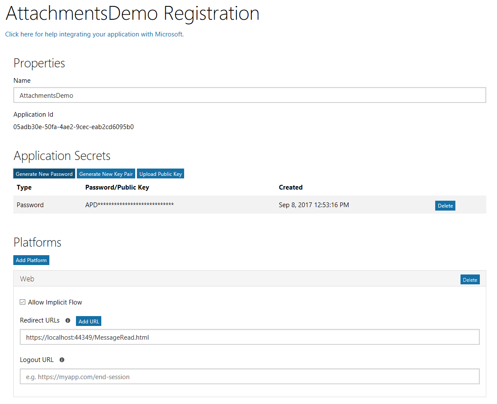
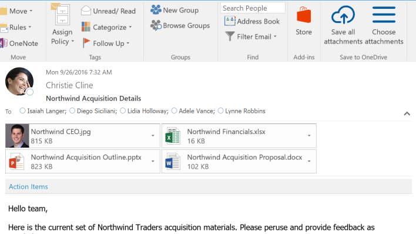
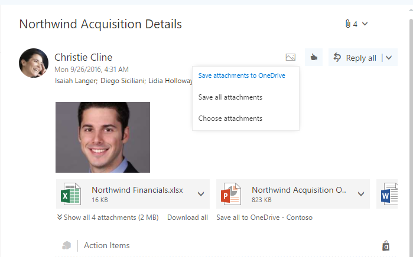

# AttachmentsDemo Sample Mail App #

The sample implements an Outlook add-in that adds buttons to the Outlook ribbon. It allows the user to save all attachments to their OneDrive. The sample illustrates the following concepts:
 
- Adding [add-in command buttons](https://dev.office.com/docs/add-ins/outlook/manifests/define-add-in-commands) to the Outlook ribbon when reading mail, including a UI-less button and a button that opens a task pane
- Implementing a WebAPI to [retrieve attachments via a callback token and the Outlook REST API](https://dev.office.com/docs/add-ins/outlook/use-rest-api)
- Authenticating to the user's OneDrive using the OAuth2 implicit flow via the [office-js-helpers library](https://github.com/OfficeDev/office-js-helpers).
- Using the [Microsoft Graph API](https://developer.microsoft.com/en-us/graph/docs/api-reference/v1.0/resources/onedrive) to create files in OneDrive.

## Configuring the Sample ##

Before you run the sample, you'll need to do a few things to make it work properly.

1. You need an Office 365 tenant or Outlook.com account. While mail apps will work with on-premise installations of Exchange, the Microsoft Graph API requires Office 365 or Outlook.com.
2. You need to register the sample application in the [Microsoft Application Registration Portal](https://apps.dev.microsoft.com) in order to obtain an app ID for accessing the Microsoft Graph API.
    1. Browse to the [Microsoft Application Registration Portal](https://apps.dev.microsoft.com). If you're not asked to sign in, click the **Go to app list** button and sign in with either your Microsoft account (Outlook.com), or your work or school account (Office 365). Once you're signed in, click the **Add an app** button. Enter `AttachmentsDemo` for the name and click **Create application**.
    1. Locate the **Platforms** section, and click **Add Platform**. Choose **Web**, then enter `https://localhost:44349/MessageRead.html` under **Redirect URIs**. Click **Save** to complete the registration. Copy the **Application Id** and save it. We'll need those values soon.
        > **Note:** The port number in the redirect URI (`44349`) may be different on your development machine. You can find the correct port number for your machine by selecting the **AttachmentDemoWeb** project in **Solution Explorer**, then looking at the **SSL URL** setting under **Development Server** in the properties window.

Here's what the details of your app registration should look like when you are done.

Replace the `YOUR APP ID HERE` value in `authconfig.js` with the application ID you generated as part of the app registration process.

## Running the Sample ##

You can run the sample right from Visual Studio. Select the **AttachmentDemo** project in **Solution Explorer**, then choose the **Start Action** value you want (under **Add-in** in the properties window). You can choose any installed browser to launch Outlook on the web, or you can choose **Office Desktop Client** to launch Outlook. If you choose **Office Desktop Client**, be sure to configure Outlook to connect to the Office 365 or Outlook.com user you want to install the add-in for.

Press **F5** to build and debug the project. You should be prompted for a user account and password. Be sure to use a user in your Office 365 tenant, or an Outlook.com account. The add-in will be installed for that user, and either Outlook on the web or Outlook will open. Select any message, and you should see the add-in buttons on the Outlook ribbon.

**Add-in in Outlook on desktop**

** Add-in in Outlook on the web**

## Copyright ##

Copyright (c) Microsoft. All rights reserved.